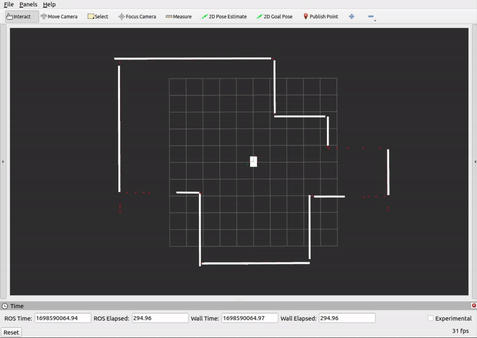
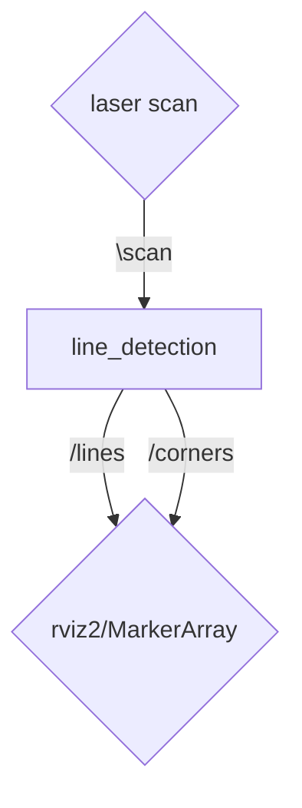

# Line Detection Algorithm

Lines detection algorithm for ROS2 framework.


## Acknowledgement

The algorithm is mostly based on the following paper: "A line segment extraction algorithm using laser data based on seeded region growing". 


## Example




## ROS2 Topics & Messages

### Subscribed Topics
 - "/scan" ([sensor_msgs/msg/LaserScan.msg](https://docs.ros2.org/latest/api/sensor_msgs/msg/LaserScan.html)
    > Laser scan message from laser sensor.
###  Published Topics
 - "/lines" ([visualization_msgs/msg/MarkerArray](https://docs.ros2.org/latest/api/visualization_msgs/msg/MarkerArray.html))
    > Marker array consisting of "LINE_STRIP" markers ([visualization_msgs/msg/Marker](https://docs.ros2.org/latest/api/visualization_msgs/msg/Marker.html)). Each "LINE_STRIP" consists two points, starting point of the detected line and the ending point.
 - "/corners" ([visualization_msgs/msg/MarkerArray](https://docs.ros2.org/latest/api/visualization_msgs/msg/MarkerArray.html))
	> Marker array consisting of "Sphere" markers. Each sphere location represent the corner location.


## Setup

- Download repository:
	```sh
	cd ~/$YOUR_ROS2_WORKSPACE$/src
	git clone https://github.com/elbazam/line_detection.git
	```
- Install repository:

	```sh
	cd ~/$YOUR_ROS2_WORKSPACE$
	colcon build --packages-select line_detection
	```

## Run

- To execute the algorithm:
	```sh
	ros2 run line_detection publish_lines
	```
## Pipeline



## Future work

- Adding config files.
- Adding corner and exit detection.

